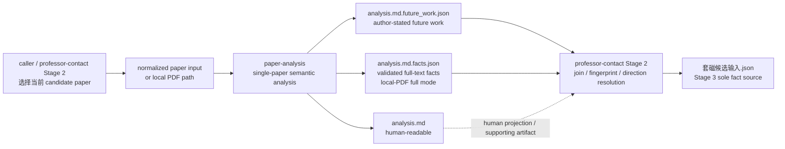

# paper-analysis

`paper-analysis` 是 ScholarWorkflow 的**单篇论文证据分析 producer**。它接受用户提供的文本、PDF、文本文件或 normalized paper-input JSON，产出基于证据的分析；它不搜索论文、不下载论文，也不拥有 Zotero 或 professor-contact 的状态机。

当前包同时面向 `opencode` 与 `codex`。

## 在套磁工作流中的位置



`paper-analysis` 不写 `_resolved_directions.json`、`套磁候选输入.json`、gap shortlist、套磁想法或邮件状态。这些属于 `professor-contact` 的 deterministic runner / Stage contract。

## Saved local-PDF full mode

对保存到磁盘的本地 PDF `mode: full`，一次分析调用必须完成三件套：

```text
<analysis>.md
<analysis>.md.future_work.json
<analysis>.md.facts.json
```

- `.future_work.json`：只保存作者明确提出的 future work / future direction 证据；普通 limitation 或读者推断不能升级成作者意图。
- `.facts.json`：由 deterministic `facts.py` 校验/写入，绑定当前 PDF fingerprint 与同一 analysis 的 future-work IDs；模型不得手写该 sidecar。
- 不允许为了补 facts 再跑第二次全文模型分析，也不允许从最终 Markdown 用 regex/grep 反向重建机器 facts。

Pasted text、`.txt/.md`、abstract-level normalized JSON 不承诺 local-PDF full-mode 的 facts 三件套。

## 输入边界

Zotero-aware caller 必须先在上游把元数据/摘要规范化成 `paper-analysis-input` JSON，再把文件路径传进来。`item_key` / `source` 只作为 provenance；`paper-analysis` 不凭它们打开 Zotero、MCP 或重新抓取论文。

## 开发参考

- [paper-analysis caller contract](.apm/skills/paper-analysis/SKILL.md)
- `scripts/paper_input.py` — normalized input validator/canonicalizer
- `scripts/future_work.py` — future-work candidate/evidence validation
- `scripts/facts.py` — structured facts validation/finalization

对套磁 workflow 的方向归属、candidate union、Stage 2 cache/resolution、Stage 3 唯一事实源等规则，应回到 `ScholarWorkflow/professor-contact` 当前 workflow reference，而不是在本仓重复定义第二套状态机。